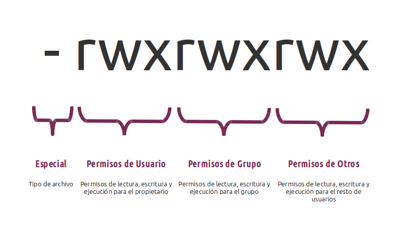

# Funciones y comandos

## Comandos

|Comando|Descripción|
|--|--|
|`ls -l`| Listado largo, Long List. Permite visualizar más información al listar, entre ellos los permisos de los archivos y usuarios|
|`pwd`| Significa Printing Work directory, es decir, imprime la ruta absoluta del directorio actual de trabajo|
|`cd `| Para regresar al comando de casa sólo ejecutar cd, por lo general el directorio de casa es: `/home/user`|
|`cd ..`| Subir un directorio o un nivel|
|`ls -l | more`|Para paginar la salida podemos usar el complemento `| more` el cual nos perdirá dar enter para seguir mostrando más contenido (Sólo aplica cuando hay mucho elementos a listar)|
|`chmod`| Change Mode. Permite cambiar los permisos de un archivo|
|`man`|Proviene de manual y nos permite obtener ayuda de un comando. Ej. `man chmod`|
|`sudo`| Super user do|

## Permisos Linux
El digito más a la izquierda corresponde a `-` para indicar que se trata de un archivo y `d` cuando se trata de un directorio.
Además hoy en día puede venir una `s` para una URL suave.

Orden de los Permisos:

|Caracter|Función|
|--|--|
|`r`|Tiene permiso de lectura|
|`w`|Tiene permiso de escritura|
|`x`|Tiene permiso de ejecución|

* El primer conjunto de 3 son los permisos para el dueño
* El siguiente grupo de 3 son los permisos para el resto del grupo de usuarios al que pertenece el dueño
* El siguiente grupo es el resto de usuarios del sistema

Para evitar accesos de otros usuarios en sus archivos se deberán aplicar los permisos `-rwx------`
Si el profesor le diera un `chmod 700 *` a todos los archivos de su sitio web no podríamos acceder a ver lo de la web, nos diría que acceso incorrecto.

Para observar los usuarios registrados en su sistema ejecuten  `cat /etc/passwd` y los grupos registrados están en `/etc/group` 
Tiene la siguiente estructura: `idUser:x:UserID:GroupID`
Cuando encontremos algo como `/sbin/nologin` significa que no se puede hacer login con este usuario

