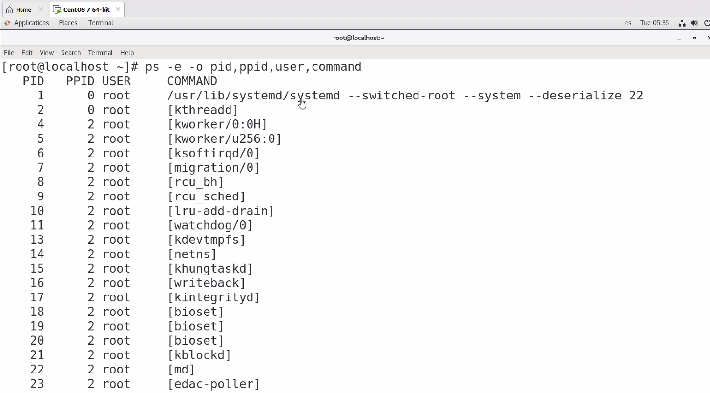

# Funciones y comandos

## Comandos

|Comando|Descripción|
|--|--|
|`ls -l`| Listado largo, Long List. Permite visualizar más información al listar, entre ellos los permisos de los archivos y usuarios|
|`pwd`| Significa Printing Work directory, es decir, imprime la ruta absoluta del directorio actual de trabajo|
|`cd `| Para regresar al comando de casa sólo ejecutar cd, por lo general el directorio de casa es: `/home/user`|
|`cd ..`| Subir un directorio o un nivel|
|`ls -l | more`|Para paginar la salida podemos usar el complemento `| more` el cual nos perdirá dar enter para seguir mostrando más contenido (Sólo aplica cuando hay mucho elementos a listar)|
|`chmod`| Change Mode. Permite cambiar los permisos de un archivo|
|`man`|Proviene de manual y nos permite obtener ayuda de un comando. Ej. `man chmod`|
|`sudo`| Super user do|
|`ps`|Process, muestra los procesos activos o vivos en esa terminal.El hecho de ejecutar el comando ps, lanza un proceso asociado a la ejecución del comando ps. Cuando una ejecución termina, el proceso asociado a esa ejecución muere|
|`ps -e -o pid,ppid,command`||

## Permisos Linux
El digito más a la izquierda corresponde a `-` para indicar que se trata de un archivo y `d` cuando se trata de un directorio.
Además hoy en día puede venir una `s` para una URL suave.

Orden de los Permisos:

|Caracter|Función|
|--|--|
|`r`|Tiene permiso de lectura|
|`w`|Tiene permiso de escritura|
|`x`|Tiene permiso de ejecución|

* El primer conjunto de 3 son los permisos para el dueño
* El siguiente grupo de 3 son los permisos para el resto del grupo de usuarios al que pertenece el dueño
* El siguiente grupo es el resto de usuarios del sistema

Para evitar accesos de otros usuarios en sus archivos se deberán aplicar los permisos `-rwx------`
Si el profesor le diera un `chmod 700 *` a todos los archivos de su sitio web no podríamos acceder a ver lo de la web, nos diría que acceso incorrecto.

Para observar los usuarios registrados en su sistema ejecuten  `cat /etc/passwd` y los grupos registrados están en `/etc/group` 
Tiene la siguiente estructura: `idUser:x:UserID:GroupID`
Cuando encontremos algo como `/sbin/nologin` significa que no se puede hacer login con este usuario

## Comando ps

* El comando ps muestra los procesos (vivos) de esa terminal o shell ejecución del comando ps muere los procesos

    El hecho de ejecutar el comando ps, lanza un proceso asociado a la ejecución del comando ps

    Recuerden que cuando una ejecución termina, el proceso asociado a esa ejecución muere

    el comando ps es como una fotografía o instantánea de los procesos no es dinámico

    

* Terminal asociada con el proceso / Terminal associed with the process **(tname=TTY)**

**Time** es el tiempo que lleva ejecutandose el proceso.

La salida ordenada por *pit*

* Comando **man ps**: Nos permite ver toda la ayuda relacionada con el comando PS.
    Muestra un snapshot (instantanea) de los procesos activos pero sólo los de esa terminal.

## Comando ps -e -o pid,ppid,command

* El comando `ps -e -o pid,ppid,command` muestra lo que le indicamos:

    

|pid|pid|owner|path|
|--|--|--|--|
|Proceso actual|Proceso Padre|Dueño|Ruta|
 

Apareceran el número de terminales:

## Creación de procesos

En Linux hay 3 maneras de crear un proceso.

* system() y viene de las librerias del lenguaje C
* fork()
* exec()

## system
La función system() provee una manera sencilla de ejecutar un comando desde un programa, como si fuera invocado desde un Shell. Invocando un programa con los privilegios de root usando la función system(), puede tener diferentes resultado de un sistema Linux a otro, debido a que es dependiente de la versión de Shell que se ocupe.

## Comando fork
Fork le devuelve al padre el pid del hijo. Mientras que al hijo le devuelve 0

Al llamar al fork creamos un hijo.

* **Fork()** le devuelve al padre el pid del hijo.
La llamada a esta función crea un nuevo proceso. El nuevo proceso o proceso hijo será una copia del proceso padre excepto por el PID y el PPID.
Cuando realizamos una llamada a fork(), el núcleo del sistema realiza las siguientes opera-
ciones:
* Buscar una entrada libre en la tabla de procesos y la reserva para el proceso hijo.
* Asigna un PID al proceso hijo, el cual es invariable y único durante toda la vida del proceso; además constituirá la clave para poder controlarlo desde otros procesos. Realiza una copia del contexto del nivel de usuario del proceso padre para el proce-
so hijo.

Programa 5:

Programa 6:

Cuando un proceso hijo está por terminar su ejecución (cuando está por morir), envía una señal a su padre. Por eso, lo ideal es que todo hijo muera antes que el padre. Pero en ocasiones sucede lo contrario, el padre muere antes que el hijo
A este tipo de procesos se les conoce como **procesos huérfanos**(orphan process)
Lo que hace Linux es que el proceso init (pid=1) adopta al proceso huérfano

Algo que debe de notarse, es que no se puede predecir si un proceso padre se va a seguir ejecutando antes o después de la creación del proceso hijo y viceversa, ya que los procesos se ejecutan asíncronamente debido al uso de la función fork(.Debido a este comportamiento no se debería de ejecutar código en el proceso hijo que dependa del proceso padre y viceversa; el hacer esto crea una condición de carrera (race condition), donde provocaría un comportamiento impredecible en el programa.

## Exec
Exec es una familia de funciones que varía en sus capacidades dependiendo en cómo se mande llamar la función.
Es una familia de funciones, todas empiezan con la palabra exec y a continuación tienen 1 o 2 letras más

### Funciones Exec

* `int execl (char *path, char *arg0,... char *argn, (char *)0);` Esa "l" significa lista. Es decir en los argumentos de la función viene indicado el comando del nuevo proceso  junto con una lista de argumentos.

    Ejecutará un comando que le estamos mandando en los argumentos, pero el comando que le pasemos a su vez podriamos tener más argumentos

    Por ejemplo el comando ls: lo podemos ejecutar asi ls nada más o lo podemos ejecutar pasando argumentos u opciones del comando
        ls -l
        ls -l /

* `int execv (char *path, char *argv[ ]);` donde "v" indica vector o arreglo

* Estas 2 funciones son la base de las siguientes 4 funciones exec:

* int execle(char *path, char *arg0,... char *argn, (char *)0, char *envp[ ]);
* int execve(char *path, char *argv[ ], char *envp[ ]);
* int execlp(char *file, char *argv[ ], char *argn, (char *)0);
* int execvp(char *file, char *argv[ ]);

