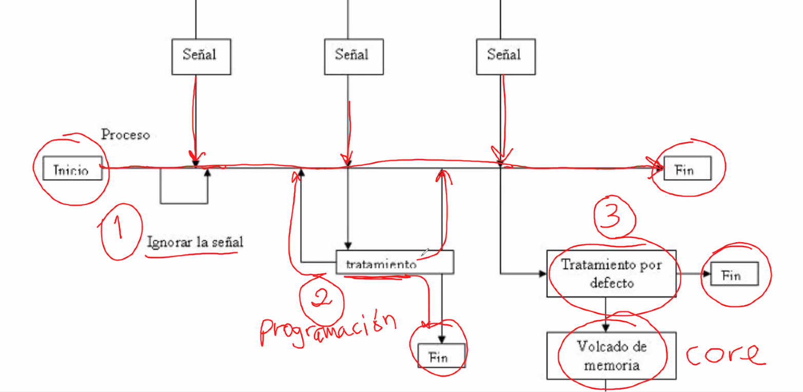
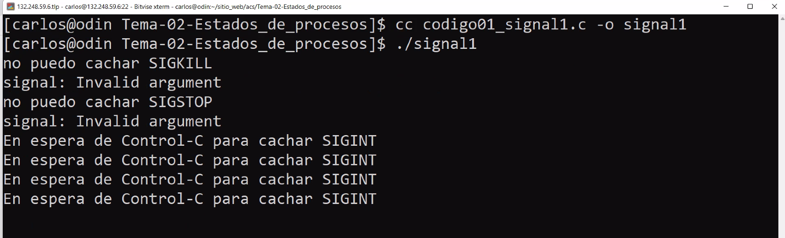
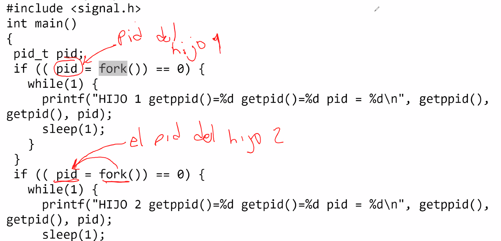
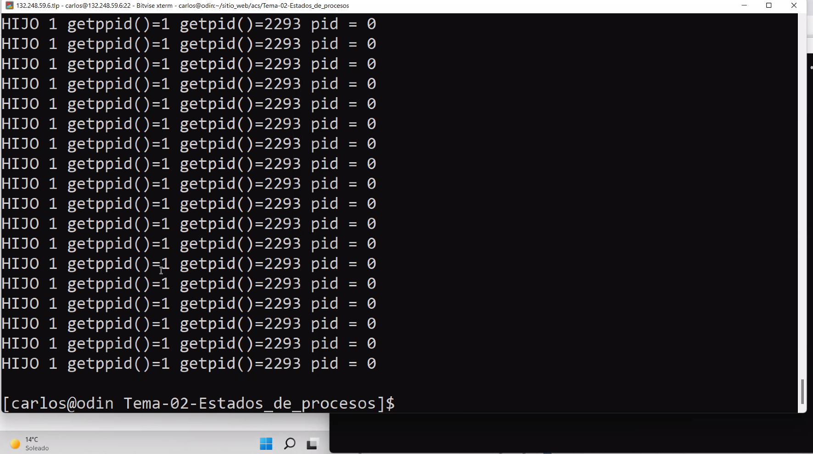

# Estados de procesos

Toda la documentación está [Aqui](http://profesores.fi-b.unam.mx/carlos/acs/Tema-02-Estados_de_procesos/)

<div align="center"></div>

Ejecutando el comando `man 7 signal` vemos la sección 7 del manual Signal, aqui viene la información del manejo de señales

<div align="center"></div>

## Ejemplo 3 - Terminación de procesos
Podemos usar `echo $?`, si el comando anteriormente ejecutado fue exitoso entonces podemos ver si fue exitoso si da **0**, dará otro valor en función de la tabla de errores vista previamente si da un error.

Por ejemplo:
```
ls 
echo $?

ls carpetaNoExistente
echo $?
```

### Ejercicios:
1. Usando el código de kill.c, crear otro proceso hijo e indicar qué es lo que pasa con el programa. 
    Para este caso la solución se encuentra identificada como [Codigo09_kill2.c](Programas/Codigo09_kill2.c)

    <div></div>

    Al ejecutar notamos que un proceso queda vivo pero el otro muere. El proceso vivo queda como un proceso de Background.  Para matarlo podemos hacerlo desde otra terminal:

    `kill -9 2293`

    Recordemos que fork() le devuelve al hijo 0 y al padre el id del hijo.

    <div></div>

    Al matar al padre vemos que regresa el prompt y el hijo 1 queda huerfano y en este caso el proceso init lo adopta, es decir, el **1**. Aunque no siempre será así, aveces para no sobrecargar `init` este genera hijos los cuales adopten los procesos huerfanos, la siguiente imagen lo describe perfectamente;
    

2. 